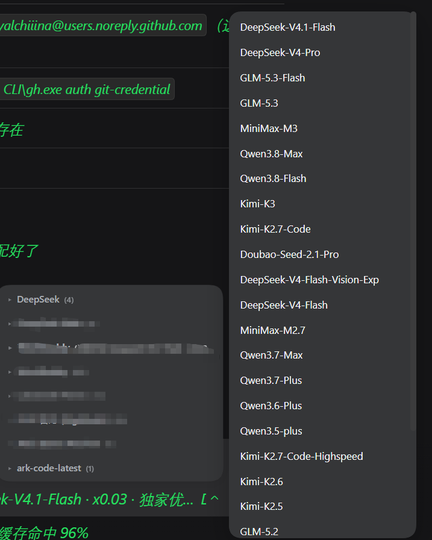

# dsh-model-fold 📋

**模型菜单别再一条道排到底。** 给 DeepSeek Harness（DSH）的模型选择菜单加**按来源（provider）分组**的导航能力。

**Stop scrolling one endless model list.** Group the DSH model picker by provider — the menu lists sources first, and each source's models open in a slide-in side panel (default) or inline below the title.



> 左下：折叠后的来源列表（`DeepSeek (4)`、`ark-code-latest (1)`…）
> 右侧：点来源后从右滑出的模型子面板（DeepSeek-V4.1-Flash、GLM-5.3、MiniMax-M3、Qwen3.8-Max、Kimi-K3…）
> Left: the folded source list · Right: the slide-in model panel for the selected source

---

## 解决什么问题 / The problem

接了三五个来源之后，模型菜单能拉出一屏还滚不完——DeepSeek、GLM、MiniMax、Qwen、Kimi 二十几个模型挤在一起，每次选模型都要眯着眼找。

Add three or five providers and the model menu runs off the screen — two dozen models jumbled together, every switch a squint-and-hunt exercise.

---

## 功能亮点（v0.4.0，双模式）

- 📋 **来源优先**：菜单只列来源（▸ 箭头 + 来源名 + 模型数），一屏看清有几个来源。
- ➡️ **右侧滑出子面板（默认）**：点来源，模型从**右侧滑出**成一列，点中即选中。
- 👁 **当前模型一眼可见**：正在使用的模型所在来源组标注 **`(当前·N) 模型名`**（加粗 + 品牌色徽标），无需打开子面板就知道用的哪个来源、哪个模型；子面板内选中项保留 ✓。
- 🔄 **双模式自由切换**：**双击任意来源标题**在「滑出面板」与「列表内展开」之间切换，选择即时生效并记住。
- 🎨 **子面板自适应主题**：背景 / 文字 / 圆角 / 选中色全部取自原菜单计算样式。
- 🧩 **纯 DOM 增强，零侵入**：面板是插件自建 DOM，选择通过程序化点击原菜单真实按钮完成，**不移动、不删除任何 React 管理的节点**，与其他插件兼容。
- 🔒 **不联网**：插件没有任何网络请求，逻辑全在本地 DOM。

## Features (v0.4.0, dual mode)

- 📋 **Sources first** — the menu lists providers only (▸ arrow + name + model count).
- ➡️ **Slide-in side panel (default)** — click a source and its models slide out from the right; click to select.
- 👁 **Current model always visible** — the active source is tagged `(current · N) model-name` (bold + brand-colour badge), with ✓ on the selection inside the panel.
- 🔄 **Two modes, switchable** — double-click any source heading to toggle between slide-in panel and inline expansion; applied instantly and remembered.
- 🎨 **Theme-adaptive panel** — background, text, radius, and selection colours all computed from the host menu's own styles.
- 🧩 **Pure DOM enhancement, zero intrusion** — the panel is plugin-owned DOM and selection happens by programmatically clicking the real menu buttons; **no React-managed node is moved or removed**, so it plays well with other plugins.
- 🔒 **No network access** — zero requests, all logic runs locally in the DOM.

两种模式的交互细节见 [docs/modes.md](docs/modes.md)，版本历史见 [CHANGELOG.md](CHANGELOG.md)。

---

## 安装 / Install

在 DSH profile 中安装（依赖 `dsh.bundle` 自声明，无需手动改 `cordis.patch.yml`）：

```bash
dsh plugin --profile desktop add dsh-model-fold
```

或安装本地 tgz：

```bash
dsh plugin --profile desktop add ./dsh-model-fold-<version>.tgz
```

或把目录复制到 profile 的 `node_modules` 并在 profile `package.json` 的 `dsh.profile.bundles` 中加入 `dsh-model-fold`。

Install from npm:

```bash
dsh plugin --profile desktop add dsh-model-fold
```

---

## 回滚 / 模式说明 · Rollback

v0.3.0 起为双模式：默认 **panel**（右侧子面板），双击任意来源标题可切换为 **inline**（下方列表展开）模式；inline 模式下折叠状态跨菜单记忆。若需要回到 v0.2.0（单 inline 模式）版本，可从 GitHub Releases 获取历史版本。

Since v0.3.0 the plugin ships two modes: **panel** (side panel, default) and **inline** (expand below the heading), switched by double-clicking any source heading. To return to the v0.2.0 single-mode behaviour, grab a historical release from GitHub Releases.

---

## 原理 / How it works

目标 DOM 是 `@deepseek-ai/dsh-client-ui-model-selection` 渲染、portal 到 `body` 的 `div[role="menu"]`：其中每个来源是一个 `section[role="group"]`，首子 `div` 为分组标题。插件用 `MutationObserver` 捕获菜单出现，在标题元素上追加自定义 data 属性与点击事件（React 不管理这些内容），用 CSS `:has()` 依据 data 属性隐藏组内模型项——不移动、不删除任何 React 管理的节点，因此不破坏原组件的渲染与状态。

The target DOM is the `div[role="menu"]` rendered by `@deepseek-ai/dsh-client-ui-model-selection` and portalled to `body`; each provider is a `section[role="group"]` whose first child `div` is the group heading. The plugin uses a `MutationObserver` to catch the menu appearing, attaches custom data attributes and click handlers to the heading (content React does not manage), and hides the in-group model items via CSS `:has()` — moving and removing nothing React owns.

---

## FAQ

- **装完没效果？** 需要重启 DSH：客户端 bundle 在宿主启动时加载进浏览器，改动/新装后必须重启才生效。
  **No effect after install?** Restart DSH — the client bundle is loaded into the browser at host startup.
- **`/model` 命令弹窗里有分组折叠吗？** 没有。本插件增强的是 composer 的模型菜单（`div[role="menu"]` 结构）；`/model` 弹窗是另一套 UI 表面，暂不涉及。
- **双击切换模式会丢折叠状态吗？** 不会。inline 模式的展开/折叠记忆独立保存；panel 模式下所有来源保持收起、由子面板展示。
- **会上传任何数据吗？** 不会。插件没有任何网络请求，全部逻辑在本地 DOM 完成。
  **Does it upload anything?** No — zero network requests, everything stays in the local DOM.

---

## License

MIT
