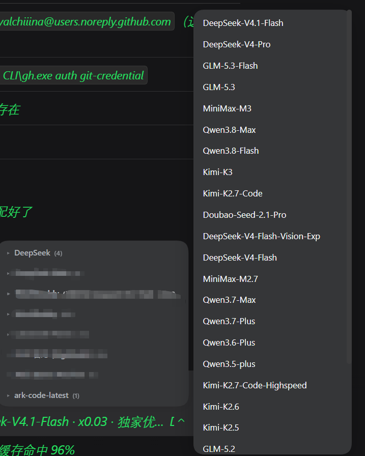

# dsh-model-fold 📋

**模型菜单别再一条道排到底。** 给 DeepSeek Harness（DSH）的模型选择菜单加**按来源（provider）分组**的导航能力。

**Stop scrolling one endless model list.** Group the DSH model picker by provider — the menu lists sources first, and each source's models open in a slide-in side panel (default) or inline below the title.



> 左下：折叠后的来源列表（`DeepSeek (4)`、`ark-code-latest (1)`…）
> 右侧：点来源后从右滑出的模型子面板（DeepSeek-V4.1-Flash、GLM-5.3、MiniMax-M3、Qwen3.8-Max、Kimi-K3…）
> Left: the folded source list · Right: the slide-in model panel for the selected source

---

## 解决什么问题 / The problem

接了三五个来源之后，模型菜单能拉出一屏还滚不完——DeepSeek、GLM、MiniMax、Qwen、Kimi 二十几个模型挤在一起，每次选模型都要眯着眼找。

Add three or five providers and the model menu runs off the screen — two dozen models jumbled together, every switch a squint-and-hunt exercise.

---

## 功能亮点（v0.4.7，双模式）

- 📋 **来源优先**：菜单只列来源（▾ 箭头 + 来源名 + 模型数），一屏看清有几个来源。
- ➡️ **右侧滑出子面板（默认）**：点来源，模型从**右侧滑出**成一列，点中即选中。
- 👁 **当前模型一眼可见**：正在使用的模型所在来源组标注 **`(当前·N) 模型名`**（加粗 + 品牌色徽标），无需打开子面板就知道用的哪个来源、哪个模型；子面板内选中项保留 ✓。
- 🔄 **双模式自由切换**：**双击任意来源标题**在「滑出面板」与「列表内展开」之间切换，选择即时生效并记住。
- 🎨 **配色与排版跟随官方**：背景、文字、悬停、圆角、字号全部与官方菜单**同源**（复用官方 `--dsw-*` 主题变量），并保证底色**不透明**、对比度充足；来源清单与子集清单**尺寸与配色完全统一**。
- 🧩 **纯 DOM 增强，零侵入**：面板是插件自建 DOM，选择通过程序化点击原菜单真实按钮完成，**不移动、不删除任何 React 管理的节点**，与其他插件兼容。
- 🔒 **不联网**：插件没有任何网络请求，逻辑全在本地 DOM。

## Features (v0.4.7, dual mode)

- 📋 **Sources first** — the menu lists providers only (▾ arrow + name + model count).
- ➡️ **Slide-in side panel (default)** — click a source and its models slide out from the right; click to select.
- 👁 **Current model always visible** — the active source is tagged `(current · N) model-name` (bold + brand-colour badge), with ✓ on the selection inside the panel.
- 🔄 **Two modes, switchable** — double-click any source heading to toggle between slide-in panel and inline expansion; applied instantly and remembered.
- 🎨 **Colours and type follow the host** — background, text, hover, radius and font size all come from the SAME `--dsw-*` tokens the official menu uses, with an enforced **opaque** background and sufficient contrast. The provider list and the model subset share identical sizing and colour.
- 🧩 **Pure DOM enhancement, zero intrusion** — the panel is plugin-owned DOM and selection happens by programmatically clicking the real menu buttons; **no React-managed node is moved or removed**, so it plays well with other plugins.
- 🔒 **No network access** — zero requests, all logic runs locally in the DOM.

---

## 适配内核 / Compatibility

| 项目 | 版本 |
|---|---|
| DSH 桌面端（内核） | **2.0.15-next**（`dsh-desktop-next`） |
| 官方模型选择组件 | `@deepseek-ai/dsh-client-ui-model-selection` **0.1.7-rc.2** |
| 客户端运行环境 | DSH Web GUI（Electron renderer，`dsh-app://app/`） |
| `engines.dsh` | `>=2.0.15-next` |

本插件增强的是 **两级下钻菜单**（`root` → `model` / `effort`）：

```text
div[role="menu"]                      ← 官方 portal 到 body 的浮层
├─ pane="root"   button[role="menuitem"]      （「模型」「推理等级」两个 cell）
├─ pane="model"  div.groups > section[role="group"][aria-labelledby]
│                 ├─ div（分组标题 = 来源名）
│                 └─ button[role="menuitemradio"]（模型项）
└─ pane="effort" 扁平的 button[role="menuitemradio"]（无 section[role="group"]）
```

插件**只增强 `pane="model"`**；`root` 与 `effort` 因不含 `section[role="group"]` 而完全不介入——这也是「思考等级」面板一直稳定的原因。

**若你的 DSH 内核版本不同**：官方若改动 `section[role="group"]` / `aria-labelledby` / `menuitemradio` 这套语义结构，插件会因选择器失配而静默不生效（不会报错、不会破坏原菜单）。可在 DSH 里按 <kbd>Ctrl</kbd>+<kbd>Shift</kbd>+<kbd>I</kbd> 打开 DevTools，确认上述结构后再提 issue。

两种模式的交互细节见 [docs/modes.md](docs/modes.md)，版本历史见 [CHANGELOG.md](CHANGELOG.md)。

---

## 安装 / Install

在 DSH profile 中安装（依赖 `dsh.bundle` 自声明，无需手动改 `cordis.patch.yml`）：

```bash
dsh plugin --profile desktop add dsh-model-fold
```

或安装本地 tgz：

```bash
dsh plugin --profile desktop add ./dsh-model-fold-<version>.tgz
```

或把目录复制到 profile 的 `node_modules` 并在 profile `package.json` 的 `dsh.profile.bundles` 中加入 `dsh-model-fold`。

Install from npm:

```bash
dsh plugin --profile desktop add dsh-model-fold
```

---

## 回滚 / 模式说明 · Rollback

v0.3.0 起为双模式：默认 **panel**（右侧子面板），双击任意来源标题可切换为 **inline**（下方列表展开）模式；inline 模式下折叠状态跨菜单记忆。若需要回到 v0.2.0（单 inline 模式）版本，可从 GitHub Releases 获取历史版本。

Since v0.3.0 the plugin ships two modes: **panel** (side panel, default) and **inline** (expand below the heading), switched by double-clicking any source heading. To return to the v0.2.0 single-mode behaviour, grab a historical release from GitHub Releases.

---

## 更新日志 / Changelog

### v0.4.7

- 🐛 **修复「子面板一闪而过」**：折叠隐藏按钮导致官方 `onBlur` 关闭整个菜单；改为隐藏前先把焦点移回 trigger。
- 🐛 **修复「点击来源没反应」**：点击事件改为 `document` 级委托，不再依赖会被 React 换掉的节点。
- 🐛 **修复「面板透明 / 文字看不清」**：支持 8 位 hex，把官方的半透明菜单表面色合成成不透明等价色，文字色按底色亮度确定对比度。
- 🎨 **来源清单与子集清单统一**：字号 15px / 字重 600 / 行高 22px / 条目高 38px / 内距 8px 10px，配色与悬停共用同一套令牌。
- 🎨 **勾选更醒目**：✓ 加大到 16px 加粗并用品牌色，选中项加品牌色左条。
- 🛡 **单例守卫**：`dispose()` 摘净所有监听器与定时器，启动新实例前先拆旧实例，杜绝热重载堆叠。
- 🧹 移除全部临时诊断代码（不再有任何日志上报或额外监听器）。

### v0.4.2

- 子面板自适应主题；双模式切换。

（更早版本见 GitHub Releases。）

---

## 原理 / How it works

目标 DOM 是 `@deepseek-ai/dsh-client-ui-model-selection` 渲染、portal 到 `body` 的 `div[role="menu"]`：其中每个来源是一个 `section[role="group"]`，首子 `div` 为分组标题。插件用 `MutationObserver` 捕获菜单出现，在标题元素上追加自定义 data 属性（React 不管理这些内容），用 CSS `:has()` 依据 data 属性隐藏组内模型项——不移动、不删除任何 React 管理的节点，因此不破坏原组件的渲染与状态。

The target DOM is the `div[role="menu"]` rendered by `@deepseek-ai/dsh-client-ui-model-selection` and portalled to `body`; each provider is a `section[role="group"]` whose first child `div` is the group heading. The plugin uses a `MutationObserver` to catch the menu appearing and attaches custom data attributes to the heading (content React does not manage), then hides the in-group model items via CSS `:has()` — moving and removing nothing React owns.

### v0.4.7 修复的三个硬骨头 / Three fixes worth documenting

这几个坑都是与**官方组件行为耦合**才出现的，改官方 UI 的插件都可能撞上：

**1. 事件必须用 document 级委托，不能挂在 React 管理的节点上**

早期版本把 `click`/`mousedown` 挂在来源标题 `div` 上。但标题是 **React 管理**的节点，pane 切换或任何重渲染都可能换掉它——监听器留在旧节点上，用户点的是新节点，于是**点击永不触发**（实测日志 `onTitleClick` 触发 0 次），表现为「点了没反应 / 一闪而过」。
现在统一由 `document` 上的**捕获期委托**处理，并按落点反查所属分组，不再持有任何节点引用。

**2. 折叠前必须先把焦点从将被隐藏的按钮上移走**

折叠靠 CSS `display:none` 隐藏真实模型按钮，而官方在进入模型列表后会**主动把焦点放到「当前选中」的那个按钮上**。两者相撞：官方聚焦 → 插件隐藏 → 浏览器**强制失焦** → 官方根节点 `onBlur` 收到 `relatedTarget = null` → `close()` → **整个菜单连同刚打开的面板一起消失**。
修复：隐藏前若发现焦点落在该分组内，先 `focus()` 回菜单 trigger（trigger 在官方 `rootRef` 内，`onBlur` 会因此放行）。

**3. 背景要取官方的「菜单表面色」并合成成不透明色**

官方菜单的 `background-color` 是 `transparent`，真正的颜色来自 CSS 变量 `--dsw-specific-menu`，而它的值形如 **`#43454a73`——8 位 hex，结尾 `73` 是 alpha ≈ 45%**。
- 若只认 `rgb()/rgba()`，会解析失败 → 面板退到祖先底色 → **比菜单暗**（颜色不一致）；
- 若直接照抄，又可能抄到 `transparent` → **面板全透明**（文字看不清）。

正确做法：解析 8 位 hex，把半透明色**按 alpha 合成到祖先底色上**，得到「看起来与菜单一致、但完全不透明」的等价色；再把同一套变量写到菜单节点上，让**来源清单与子集清单共用同一底色**。

### 与 React 共存的其余纪律

- **单例守卫**：热重载会反复执行 `apply`，`dispose()` 必须摘净**所有**监听器与定时器；启动新实例前还要显式拆掉上一个实例，否则多个实例同时处理同一次点击、互相 open/close 面板。
- **焦点不转移**：面板项不设 `tabindex`、不主动 `focus()`——面板挂在 `body`，不在官方 `rootRef/menuRef` 内，焦点一旦进入面板就等于「离开菜单」，会触发官方 `close()`。
- **面板挂 `body`**：官方菜单是 React portal 子树，任何重渲染都会回收其非 React 子节点；面板必须挂在 `body` 并用 `fixed` 定位。

---

## FAQ

- **装完没效果？** 需要重启 DSH：客户端 bundle 在宿主启动时加载进浏览器，改动/新装后必须重启才生效。
  **No effect after install?** Restart DSH — the client bundle is loaded into the browser at host startup.
- **`/model` 命令弹窗里有分组折叠吗？** 没有。本插件增强的是 composer 的模型菜单（`div[role="menu"]` 结构）；`/model` 弹窗是另一套 UI 表面，暂不涉及。
- **双击切换模式会丢折叠状态吗？** 不会。inline 模式的展开/折叠记忆独立保存；panel 模式下所有来源保持收起、由子面板展示。
- **会上传任何数据吗？** 不会。插件没有任何网络请求，全部逻辑在本地 DOM 完成。
  **Does it upload anything?** No — zero network requests, everything stays in the local DOM.

---

## License

MIT
